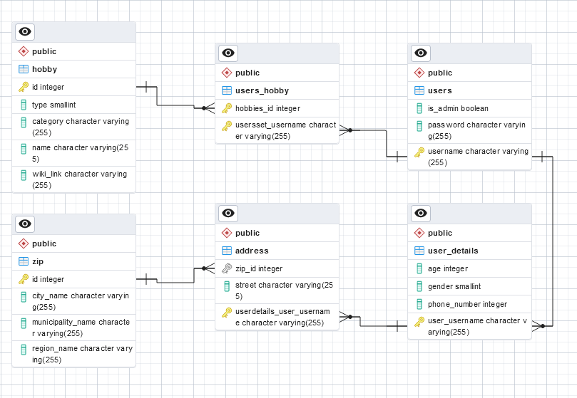

# SP1-Hobby-29-02-24

## Business Idea:
The business idea is to create a platform that not only provides information about people and their hobbies but also offers a matchmaking service. Users can input their hobbies and interests, and the platform can connect them with like-minded individuals or groups in their local area. This would add a social networking element to the service and encourage people to explore new hobbies together, fostering real-world connections.

## DOMAIN MODEL:

## ERD:

## GROUP DESCRIPTION - HOW WE WORKED:

- Used Kanban for project overview and distribution of to-do's.
- Day 1: Created Github repository for the project + Kanban board. Created Domainmodel and ER-diagram. Created project in IntelliJ and established entity relations.

## TECHNICAL REQUIREMENTS:

- JPA
- JPQL
- Java Streams API
- Java Generics
- Maven
- JDK 17^
- JUnit 5
- Docker
- PostgresSQL
- pgAdmin
- Lombok
