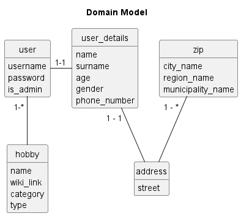
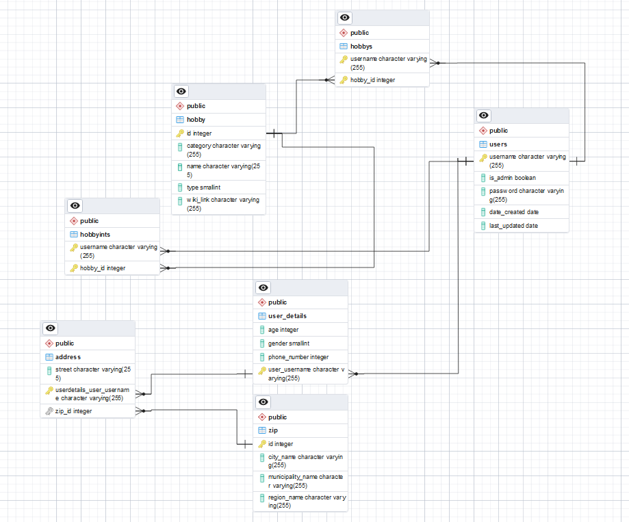
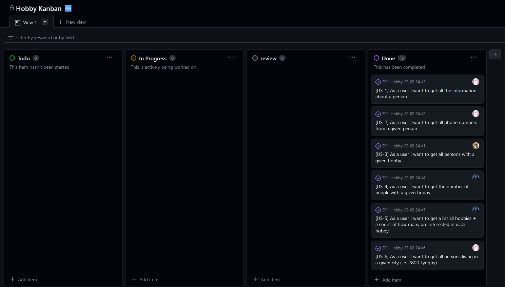

# SP1-Hobby-29-02-24

## Business Idea:
The business idea is to create a platform that not only provides information about people and their hobbies but also offers a matchmaking service. Users can input their hobbies and interests, and the platform can connect them with like-minded individuals or groups in their local area. This would add a social networking element to the service and encourage people to explore new hobbies together, fostering real-world connections.

## DOMAIN MODEL:

## ERD:

## GROUP DESCRIPTION - HOW WE WORKED:

- Used Kanban for project overview and distribution of to-do's. Each group member assigned themselves a few USER-STORIES that they wanted to work on.
- The initial project was created in unision, with each relation for every entity being decided upon together.

### Group members:

- Patrick Fabrin | email: cph-pf73@cphbuisiness.dk
  
- Christian Høj | email: cph-ch633@cphbusiness.dk

- Nicolai Theis Rolin | email: cph-nr140@cphbusiness.dk

- Nicklas Waldemar Seier Winther | email: cph-nw89@cphbusiness.dk

## KANBAN BOARD:

### Link to project: https://github.com/users/NokIkNick/projects/3

## TECHNICAL REQUIREMENTS:

- JPA
- JPQL
- Java Streams API
- Java Generics
- Maven
- JDK 17^
- JUnit 5
- Docker
- PostgresSQL
- pgAdmin
- Lombok
